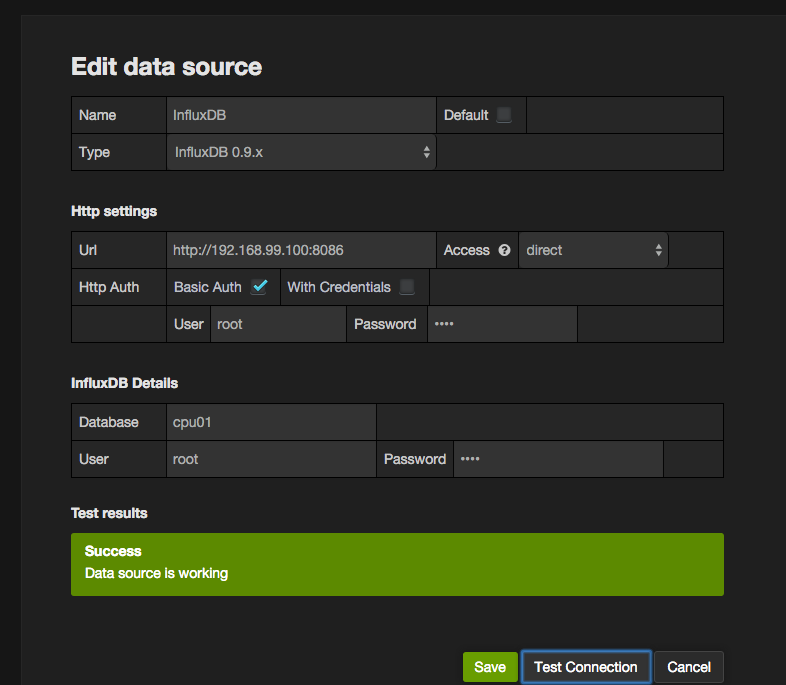

Docker Monitor Example
======================

References:
1. http://lkhill.com/using-influxdb-grafana-to-display-network-statistics/

### RUN

```
$> docker-compose up
```

### Grafana
```
$> open http://192.168.99.100:3000/
```

admin/admin

### Data Sources




### InfluxDB

```
$> open http://192.168.99.100:8083/
```

root/root
